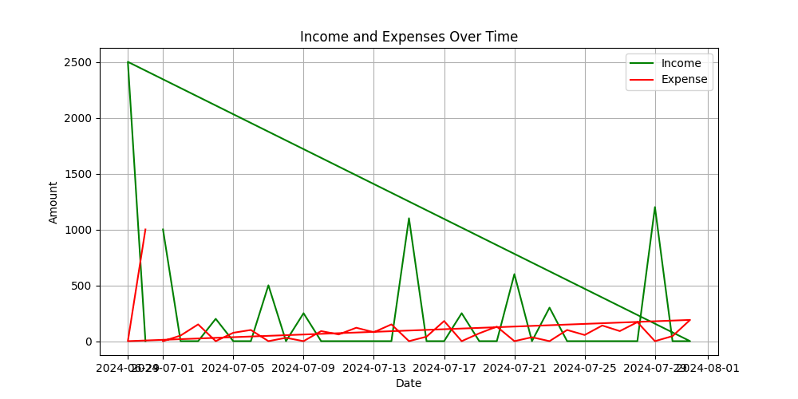

# Personal Finance Tracker

## Overview

The Personal Finance Tracker is a simple Python application designed to help users manage their finances. It allows users to add financial transactions, view transaction summaries, and visualize income and expenses over time. The application stores data in a CSV file and provides a command-line interface for interaction.

## Features

- **Add Transactions:** Users can input transaction details including date, amount, category (Income or Expense), and description.
- **View Transactions:** Users can view transactions and get a summary of total income, expenses, and net savings within a specified date range.
- **Visualize Data:** The application can generate a plot showing income and expenses over time.

## Getting Started

### Prerequisites

Ensure you have Python 3.6 or higher installed on your system. You will also need the following Python packages:
- `pandas`
- `matplotlib`

You can install the required packages using pip:

```bash
pip install pandas matplotlib
```

### Setting Up

1. **Clone the Repository:**

    ```bash
    git clone https://github.com/sahilmate/personal-finance-tracker.git
    cd personal-finance-tracker
    ```

2. **Create a CSV File:**

    The application uses `finance_data.csv` to store transactions. The file will be automatically created if it does not exist.

3. **Run the Application:**

    ```bash
    python main.py
    ```

## Usage

1. **Add a New Transaction:**
    - Select option 1 from the menu.
    - Enter the date (or press Enter to use today’s date).
    - Provide the amount.
    - Choose the category by entering 'I' for Income or 'E' for Expense.
    - Optionally, provide a description.

2. **View Transactions and Summary:**
    - Select option 2 from the menu.
    - Enter the start and end dates for the transaction range.
    - The application will display transactions in the specified range and provide a summary of total income, expenses, and net savings.
    - You will also have the option to generate a plot of income and expenses over time.

3. **Exit:**
    - Select option 3 to exit the application.

## Code Structure

- `main.py`: The main script that runs the application, handles user input, and performs operations based on user choices.
- `data_entry.py`: Contains functions to get user input for date, amount, category, and description. Also handles CSV file operations through the `CSV` class.
- `finance_data.csv`: CSV file where transactions are stored.

## CSV File Format

The `finance_data.csv` file should have the following format:

```
date,amount,category,description
01-07-2024,1000,Income,Salary
...
```

Ensure that there are no formatting errors, such as missing commas or mismatched fields.

## Troubleshooting

- **Error Tokenizing Data:** This error often occurs if the CSV file contains malformed data. Ensure that the file does not have any incorrect formatting or extra commas.
- **Invalid Date Format:** Ensure that dates are entered in the format `dd-mm-yyyy`.

## Output Example

### Adding a Transaction

```
Enter the date of the transaction (dd-mm-yyyy) or enter for today's date: 29-06-2024
Enter the amount: 2500
Enter the category ('I' for Income or 'E' for Expense): I
Enter a description (optional): Birthday
Entry added successfully
```

### Viewing Transactions

```
Transactions from 14-12-2023 to 30-06-2024
        date  amount  category   description
14-12-2023    124.0  Expense    Groceries
29-06-2024   2500.0  Income     Birthday

Summary:
Total Income: $2500.00
Total Expense: $124.00
Net Savings: $2376.00
```

### Plot Example


The graph helps visualize the distribution of income and expenses, providing insights into your financial trends.

## Contribution

Contributions are welcome! Please submit a pull request or open an issue if you have suggestions or improvements.


